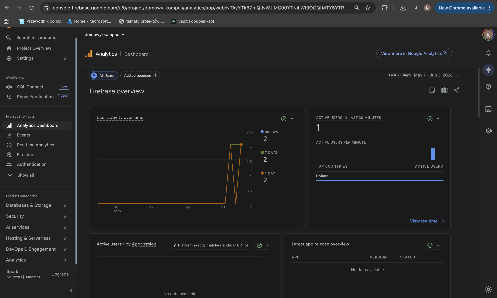
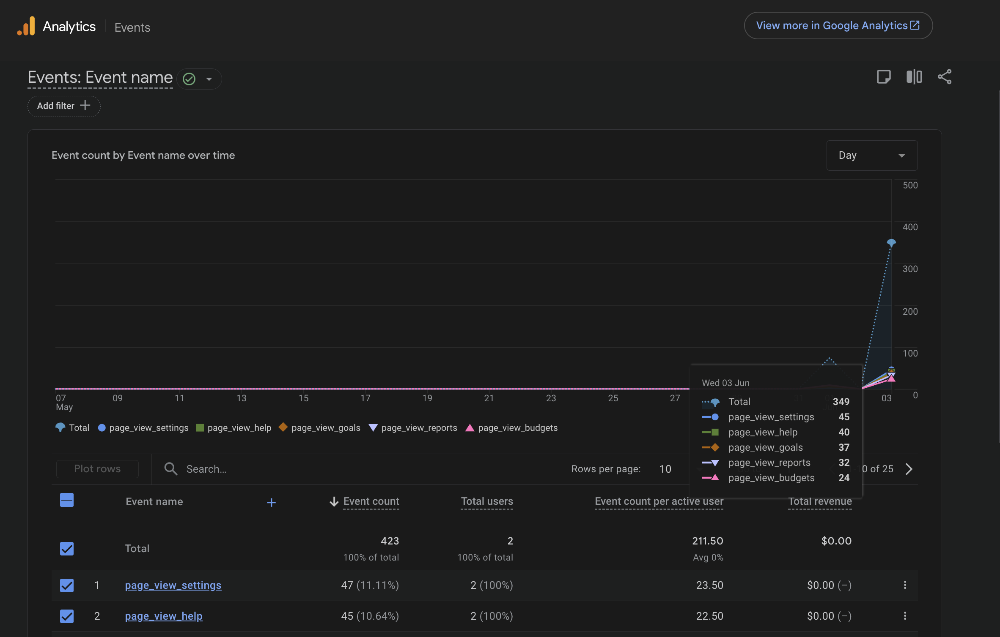

# Analityka (Google Analytics)

Firebase Analytics — śledzenie zdarzeń w Domowy Kompas.

## Konfiguracja

Analytics jest inicjalizowany w `src/config/firebase.ts`. Wymaga zmiennej `VITE_FIREBASE_MEASUREMENT_ID` w środowisku. Jeśli zmienna nie istnieje, analityka jest niedostępna (aplikacja działa normalnie).

## Helper API

Zdefiniowane w `src/utils/analytics.ts`.

```ts
trackEvent(eventName: string, params?: Record<string, unknown>)
trackPageView(pageName: string)  // wywołuje page_view_{pageName}
```

Obie funkcje są bezpieczne — po cichu kończą działanie, jeśli Analytics jest niedostępny lub zablokowany.

## Zrzuty ekranu z panelu Firebase

### Przegląd — kluczowe metryki


*Liczba użytkowników, sesji, średni czas zaangażowania.*

### Zdarzenia — najpopularniejsze akcje


*Ranking zdarzeń: page_view, user_login, transaction_created itd.*

## Zdarzenia — wyświetlenia stron

| Komponent | Zdarzenie | Status |
|-----------|-----------|--------|
| `LandingPage` | `page_view_landing` | ✅ |
| `Dashboard` | `page_view_dashboard` | ✅ |
| `TransactionsPage` | `page_view_transactions` | ✅ |
| `Budgets` | `page_view_budgets` | ✅ |
| `Goals` | `page_view_goals` | ✅ |
| `Reports` | `page_view_reports` | ✅ |
| `Settings` | `page_view_settings` | ✅ |
| `Help` | `page_view_help` | ✅ |

## Zdarzenia — interakcje

| Zdarzenie | Miejsce | Status |
|-----------|---------|--------|
| `user_login` | `LoginCard` | ✅ |
| `user_logout` | `AuthContext` | ✅ |
| `user_registration_started` | `Register` | ✅ |
| `user_registration_completed` | `AuthContext` | ✅ |
| `password_reset_requested` | `LoginCard` | ✅ |
| `transaction_created` | `AddTransactionForm` | ✅ |
| `transaction_filtered` | `TransactionsHeader` | ✅ |
| `budget_status_exceeded` | `Budgets` | ✅ |
| `goal_progress_tracked` | `Goals` | ✅ |
| `report_period_changed` | `Reports` | ✅ |
| `report_date_navigated` | `Reports` | ✅ |
| `payment_method_added` | `Settings` | ✅ |
| `payment_method_removed` | `Settings` | ✅ |
| `settings_tab_switched` | `Settings` | ✅ |
| `faq_expanded` | `Help` | ✅ |
| `help_topic_viewed` | `Help` | ✅ |
| `auth_error` | `LoginCard` / `Register` | ✅ |
| `transaction_save_failed` | `AddTransactionForm` | ✅ |
| `data_load_error` | Dashboard, Budgets, Goals, Reports | ✅ |

## Użycie w kodzie

```ts
import { trackEvent } from '../utils/analytics'

// Proste zdarzenie
trackEvent('user_login')

// Z parametrami (bez PII!)
trackEvent('transaction_created', { category: 'food' })
```
