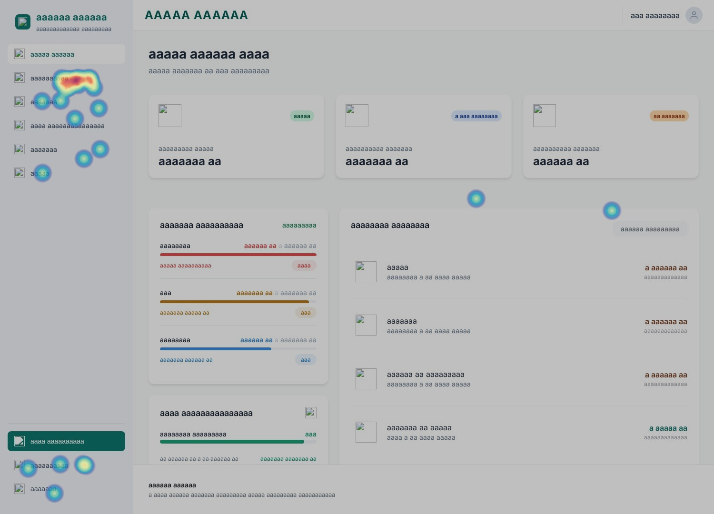
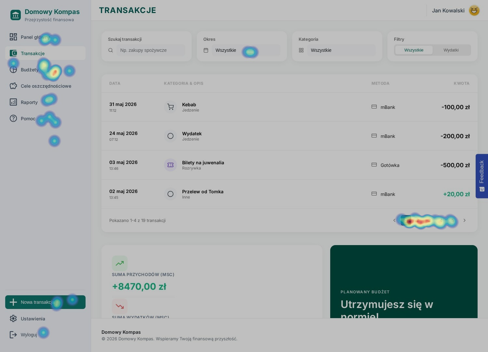
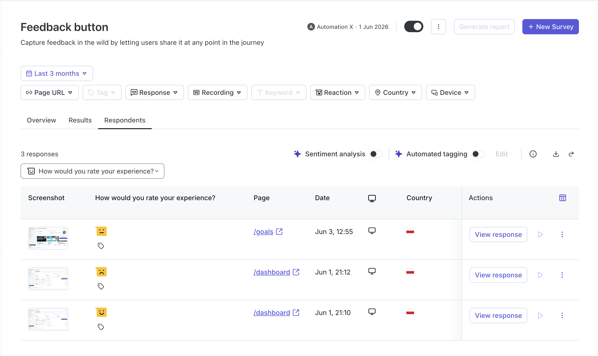

# Hotjar — analiza zachowań użytkowników

Hotjar jest zintegrowany przez skrypt ContentSquare (`index.html:10`) — ContentSquare przejął Hotjar, dane są zbierane za jego pośrednictwem. Poniżej zebrano kluczowe obserwacje z map ciepła, nagrań sesji oraz feedbacku.

## Mapy ciepła

### Dashboard

*Które elementy na dashboardcie przyciągają najwięcej kliknięć?*

### Transakcje

*Czy użytkownicy korzystają z filtrów i wyszukiwarki?*

## Feedback / Ankiety

*Wyniki ankiet zbieranych w aplikacji (NPS, satysfakcja z funkcji).*
