# Zrzuty ekranu — Domowy Kompas

Poniższe zrzuty przedstawiają wygląd aplikacji na poszczególnych widokach.

## Strona główna / Landing Page

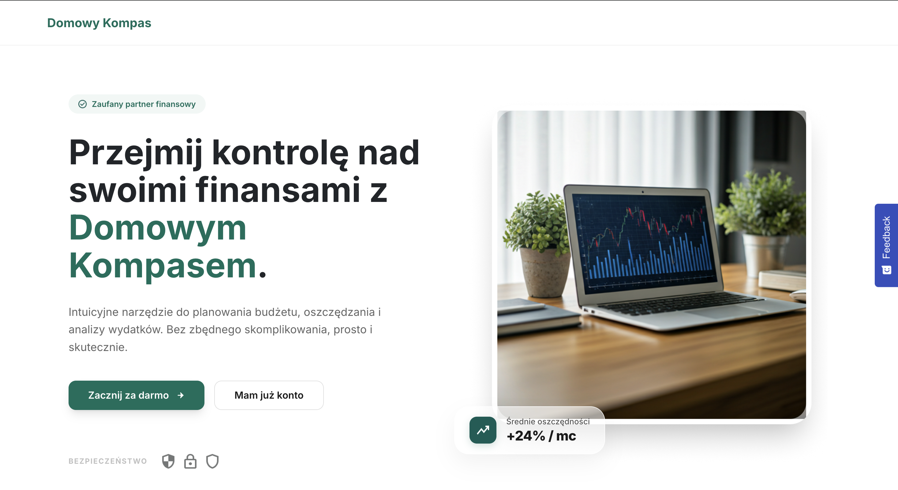
*Strona główna — hero, funkcje, opinie użytkowników.*

## Logowanie i rejestracja

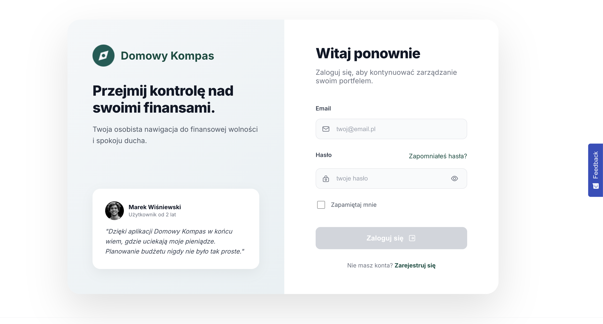
*Panel logowania z brandingiem po lewej i formularzem po prawej.*

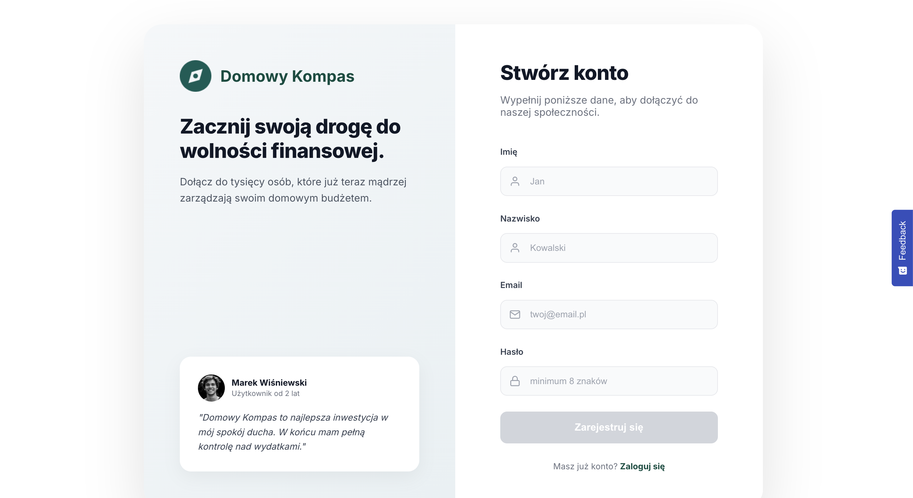
*Formularz rejestracji nowego użytkownika.*

## Dashboard

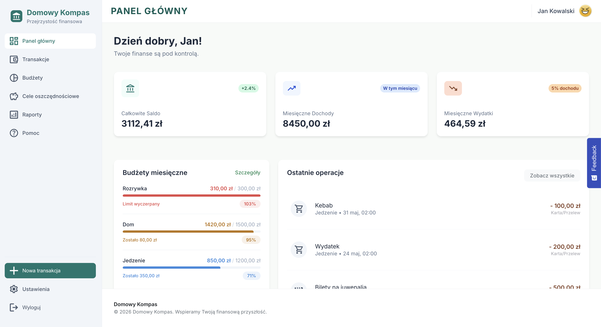
*Panel główny — KPI (saldo, przychody, wydatki), budżety, cele, ostatnie operacje.*

## Transakcje

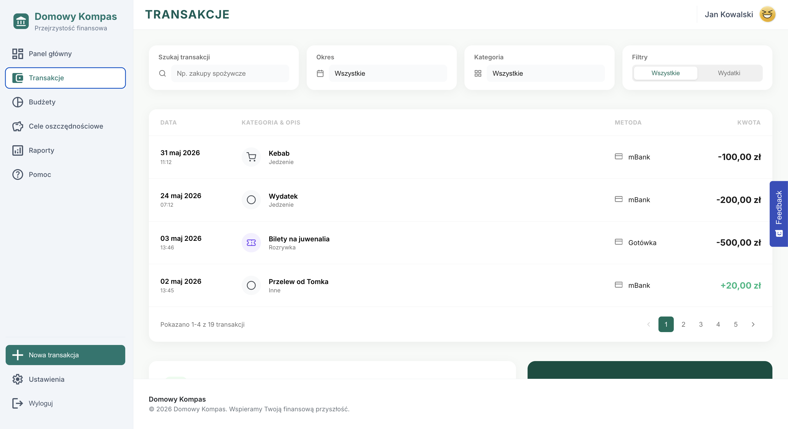
*Lista transakcji z filtrowaniem, wyszukiwarką i paginacją.*

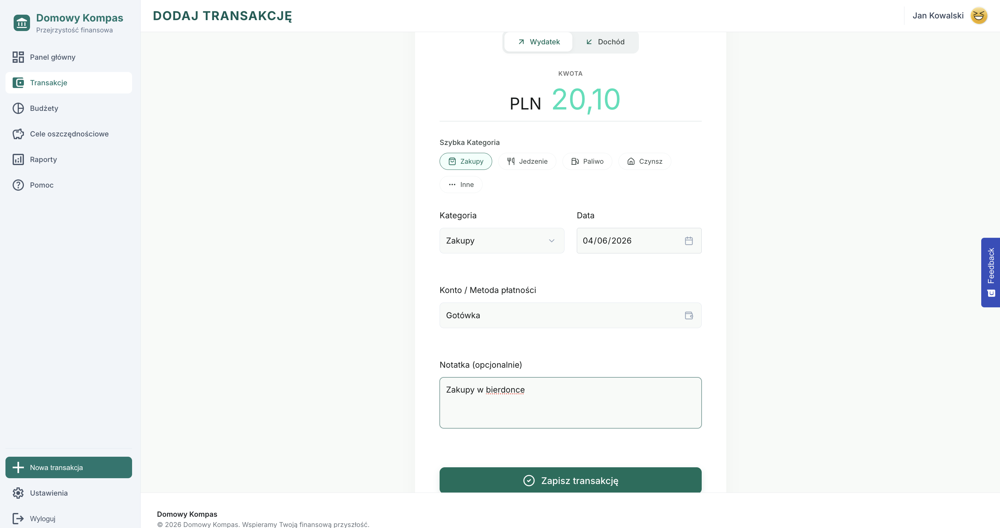
*Formularz dodawania nowej transakcji (wydatek/przychód).*

## Budżety

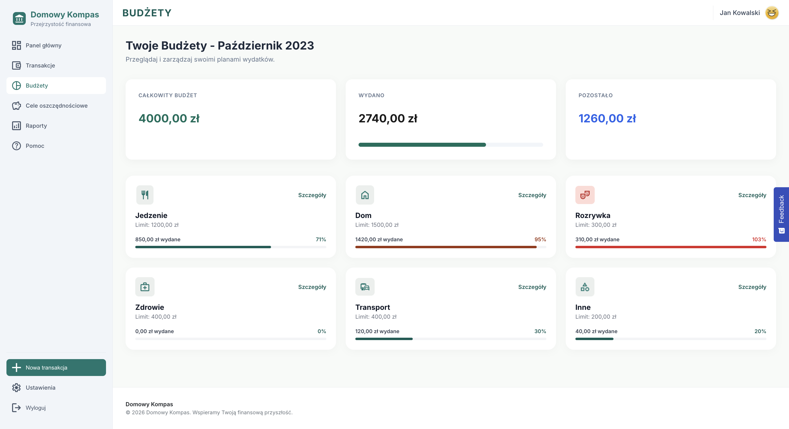
*Przegląd budżetów z progress barami i statusem wykorzystania.*

## Cele oszczędnościowe

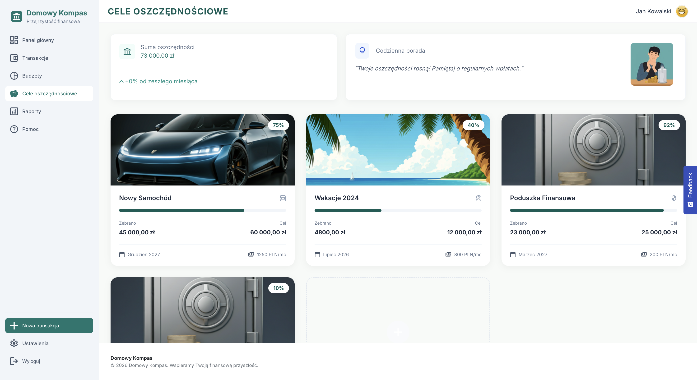
*Lista celów oszczędnościowych z paskami postępu.*

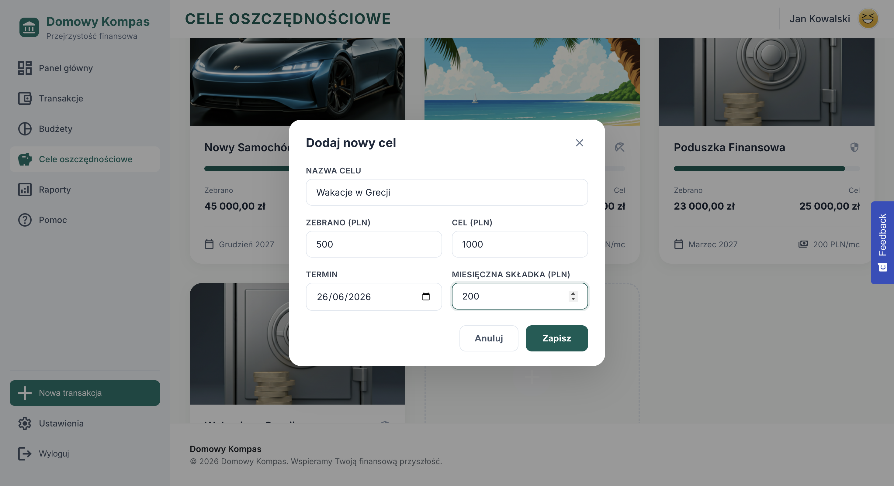
*Modal dodawania nowego celu.*

## Raporty

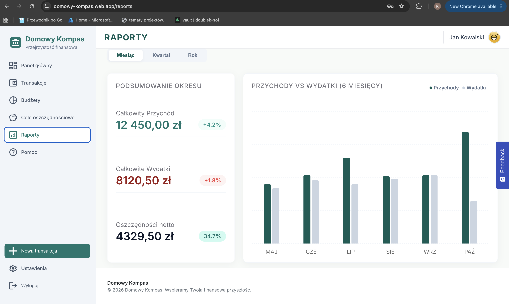
*Widok raportów — wykres słupkowy (przychody/wydatki) i kołowy (kategorie wydatków).*

## Ustawienia

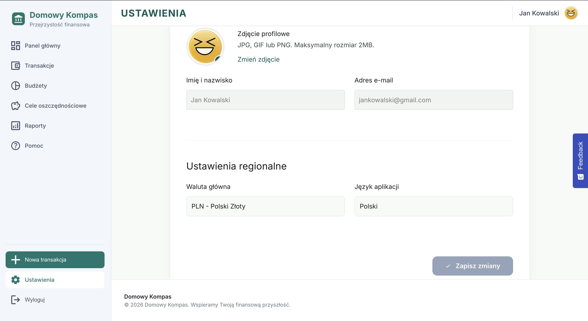
*Zakładki: profil (awatar, dane, regionalne) i metody płatności.*

## Pomoc

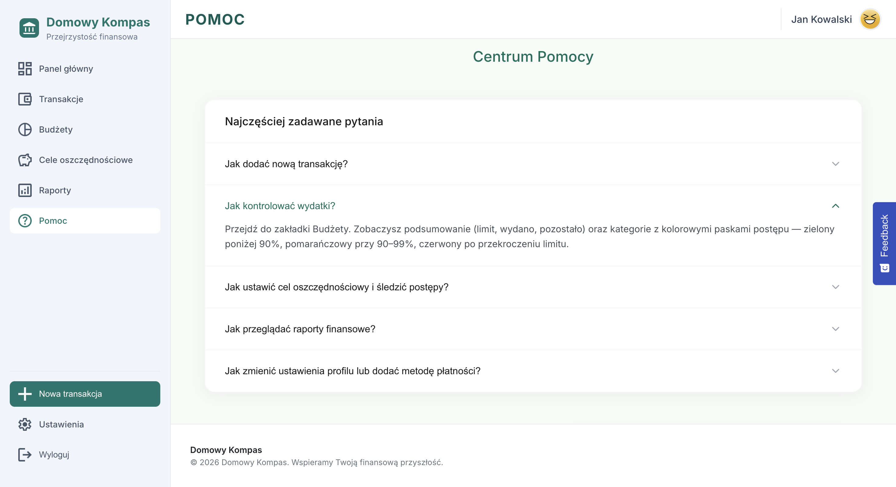
*FAQ z akordeonem i formularz kontaktowy.*
